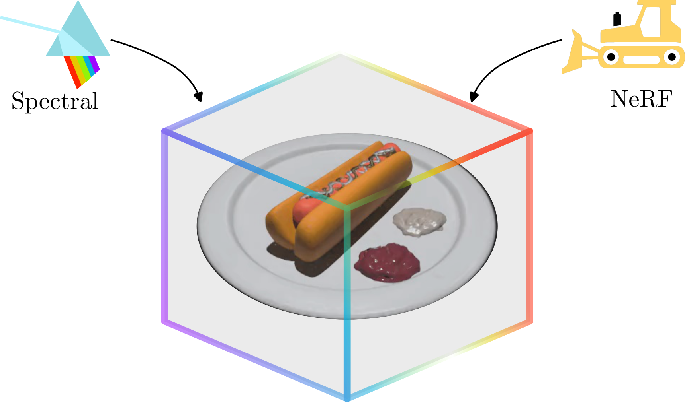

# <span style="color: #8A2BE2;">U</span><span style="color: #4169E1;">n</span><span style="color: #00CED1;">M</span><span style="color: #32CD32;">i</span><span style="color: #FFD700;">x</span>-NeRF: Spectral Unmixing Meets Neural Radiance Fields

<div align="center">

[](https://arxiv.org/pdf/2301.03580)
[](https://factral.github.io/UnMix-NeRF)
[](https://huggingface.co/datasets/Factral/NeSpoF-segmentation)

</div>

<div>
  <p align="center" style="font-size: larger;">
    <strong>ICCV 2025</strong>
  </p>
</div>

<div align="center">
  
  <br>

  <div align="center">

**[Fabian Perez](https://github.com/Factral)¹² · [Sara Rojas](https://sararoma95.github.io/sr/)² · [Carlos Hinojosa](https://carloshinojosa.me/)² · [Hoover Rueda-Chacón](http://hfarueda.com/)¹ · [Bernard Ghanem](https://www.bernardghanem.com/)²**

¹Universidad Industrial de Santander · ²King Abdullah University of Science and Technology (KAUST)

</div>

  
**TL;DR:** We propose UnMix-NeRF, the first method integrating spectral unmixing into NeRF, enabling hyperspectral view synthesis, accurate unsupervised material segmentation, and intuitive material-based scene editing, significantly outperforming existing methods.

</div>

---


## 📖 Abstract

Neural Radiance Field (NeRF)-based segmentation methods focus on object semantics and rely solely on RGB data, lacking intrinsic material properties. This limitation restricts accurate material perception, which is crucial for robotics, augmented reality, simulation, and other applications. We introduce **UnMix-NeRF**, a framework that integrates spectral unmixing into NeRF, enabling joint hyperspectral novel view synthesis and unsupervised material segmentation. Our method models spectral reflectance via diffuse and specular components, where a learned dictionary of global endmembers represents pure material signatures, and per-point abundances capture their distribution. For material segmentation, we use spectral signature predictions along learned endmembers, allowing unsupervised material clustering. Additionally, UnMix-NeRF enables scene editing by modifying learned endmember dictionaries for flexible material-based appearance manipulation.


## 🛠️ Installation

UnMix-NeRF is built upon [Nerfstudio](https://docs.nerf.studio/). Follow these steps to install:

### 1. Install Nerfstudio Dependencies

Follow the [Nerfstudio installation guide](https://docs.nerf.studio/quickstart/installation.html) up to and including "tinycudann" to install dependencies and create an environment. You need GPU to run the method, and python 3.10+ to run the code.


### 2. Clone this Repository

```bash
git clone https://github.com/Factral/UnMix-NeRF
cd UnMix-NeRF
pip install -r requirements.txt
```

### 3. Install as Python Package

```bash
pip install -e .
```

### 4. Verify Installation

Run `ns-train -h` and verify that `unmixnerf` appears in the list of available methods.

## 📁 Data Format

UnMix-NeRF extends the standard [Nerfstudio data conventions](https://docs.nerf.studio/quickstart/data_conventions.html) to support hyperspectral data:

### Required Data Structure

```
data/
├── transforms.json          # Camera poses and intrinsics (standard)
├── images/                  # RGB images (standard)
│   ├── frame_00001.jpg
│   └── ...
├── hyperspectral/          # Hyperspectral data (NEW)
│   ├── frame_00001.npy
│   └── ...
└── segmentation/           # Ground truth segmentation (optional)
    ├── frame_00001.png
    └── ...
```

### Hyperspectral Data Requirements

- **Format**: `.npy` files with dimensions `(H, W, B)` where:
  - `H`: Image height
  - `W`: Image width  
  - `B`: Number of spectral bands
- **Value Range**: Normalized between 0 and 1
- **File Naming**: Must correspond to RGB images (e.g., `frame_00001.npy` ↔ `frame_00001.jpg`)

### JSON Configuration

Add these fields to your `transforms.json`:

```json
{
  "frames": [
    {
      "file_path": "./images/frame_00001.jpg",
      "hyperspectral_file_path": "./hyperspectral/frame_00001.npy",
      "seg_file_path": "./segmentation/frame_00001.png",  // optional
      "transform_matrix": [...]
    }
  ]
}
```

### 📊 Datasets

We evaluate UnMix-NeRF on the following hyperspectral datasets:

- [NeSpoF](https://drive.google.com/drive/folders/1W7apuXPA3EkyUs8VgZgwdMpnc96aLXXJ) for synthetic scenes,
- [NeSpoF-Segmentation](https://huggingface.co/datasets/Factral/NeSpoF-segmentation) (our extended version with material labels)
- [HS-NeRF](https://docs.google.com/document/d/1kD_72gDf_tr3QhBVcyzQ5HV8HkqAW6QOi-zHVwkBrNg/edit?usp=sharing) dataset containing BaySpec and Surface Optics real-world captures

### Optional: Endmember Initialization

To initialize endmembers using VCA (Vertex Component Analysis), place a `vca.npy` file in your data directory:

- **Format**: `.npy` file with dimensions `(C, B)` where:
  - `C`: Number of endmembers/materials
  - `B`: Number of spectral bands
- **Usage**: Set `--pipeline.model.load_vca True` in training command

## 🎯 Usage


### Training with Custom Parameters

```bash
ns-train unmixnerf \
  --data <path_to_data> \
  --pipeline.num_classes <number_of_materials> \
  --pipeline.model.spectral_loss_weight <spectral_loss_weight> \
  --pipeline.model.temperature <temperature> \
  --pipeline.model.load_vca <True/False> \
  --experiment-name my_experiment \
  --vis viewer+wandb
```

### Key Parameters

| Parameter | Description | Default |
|-----------|-------------|---------|
| `--pipeline.num_classes` | Number of material endmembers | 6 |
| `--pipeline.model.spectral_loss_weight` | Weight for spectral reconstruction loss | 5.0 |
| `--pipeline.model.temperature` | Temperature for abundance softmax | 0.4 |
| `--pipeline.model.load_vca` | Initialize endmembers with VCA | False |
| `--pipeline.model.pred_specular` | Enable specular component prediction | True |

## Results

Use the provided scripts in the `scripts/` directory to reproduce results on different scenes:

```bash
# Hotdog scene
bash scripts/hotdog.sh

# Anacampseros scene  
bash scripts/anacampseros.sh

# Caladium scene
bash scripts/caladium.sh

# Other scenes
bash scripts/ajar.sh
bash scripts/cbox_dragon.sh
bash scripts/cbox_sphere.sh
bash scripts/pinecone.sh
```

Each script contains optimized hyperparameters for the specific scene.

## 👁️ Viewer

### Custom Viewer

UnMix-NeRF includes a customized Nerfstudio viewer that supports:

- **Spectral Band Visualization**: View individual wavelengths
- **Material Abundance Maps**: Visualize learned material distributions
- **Segmentation Results**: Display unsupervised material clustering

### Saved Outputs

After training completion, the following are automatically saved:

- **Learned Endmembers**: `endmembers.npy` - Final converged material signatures
- **Trained model**: `outputs/` - Trained model weights


## 🎓 Citation

If you find this work useful, please cite our paper:

```bibtex
@inproceedings{perez2025unmix,
  title={UnMix-NeRF: Spectral Unmixing Meets Neural Radiance Fields},
  author={Perez, Fabian and Rojas, Sara and Hinojosa, Carlos and Rueda-Chac{\'o}n, Hoover and Ghanem, Bernard},
  booktitle={Proceedings of the IEEE/CVF International Conference on Computer Vision},
  year={2025}
}
```

## 🙏 Acknowledgments

- Built upon [Nerfstudio](https://docs.nerf.studio/) framework

---

<div align="center">
  <b>🌟 Star this repository if you find it useful! 🌟</b>
</div>
